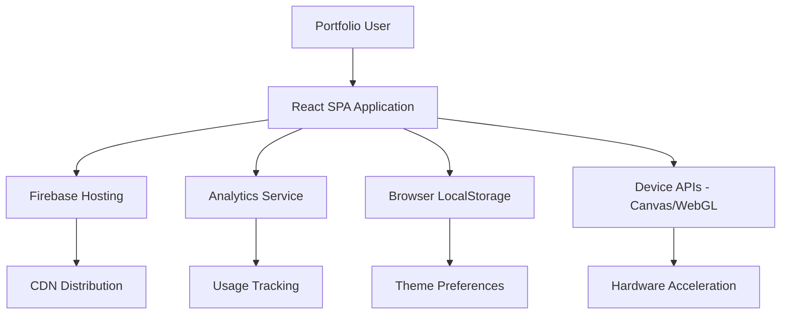
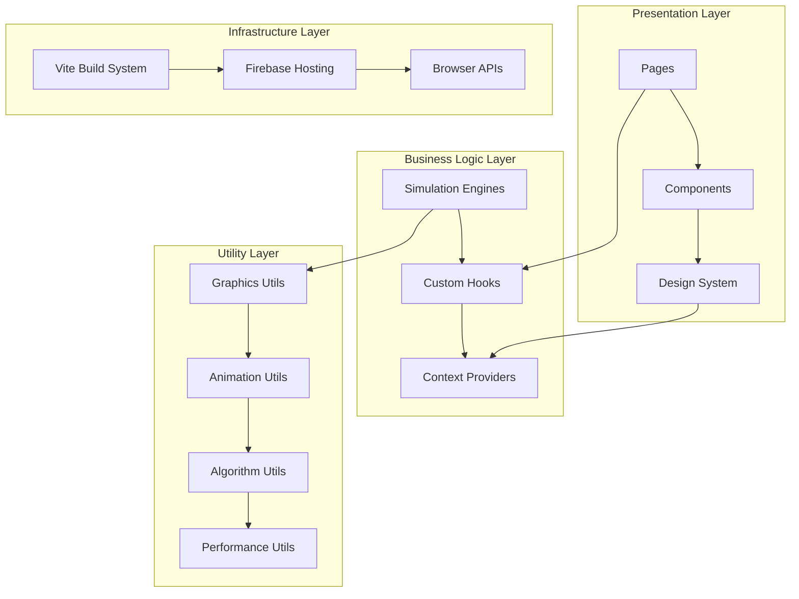
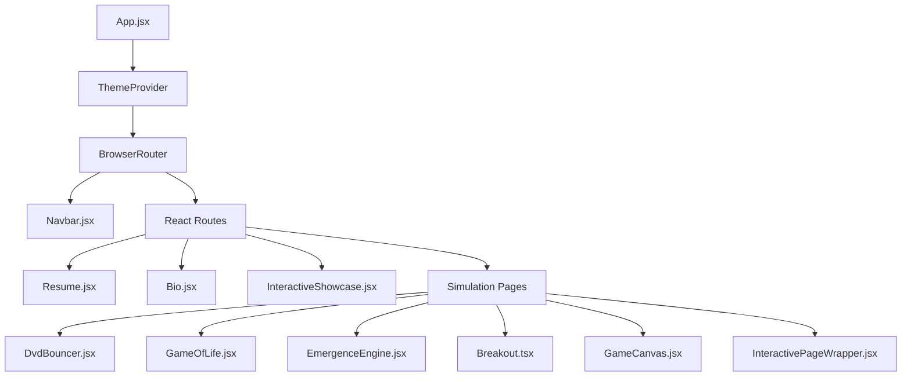
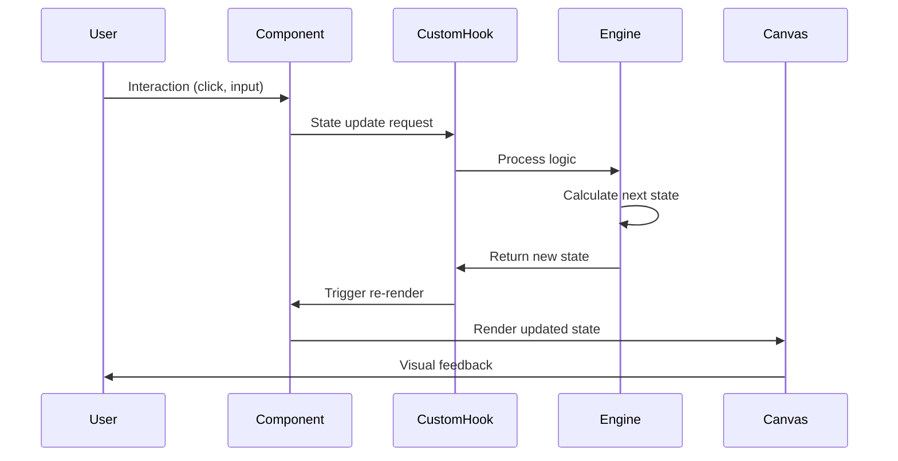
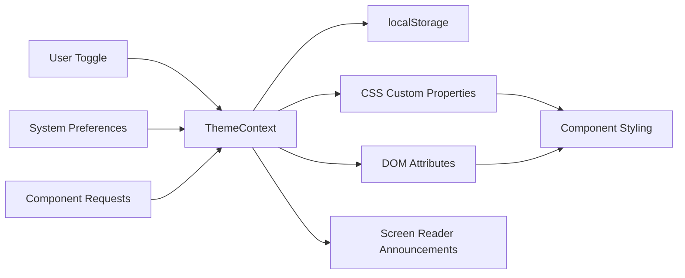
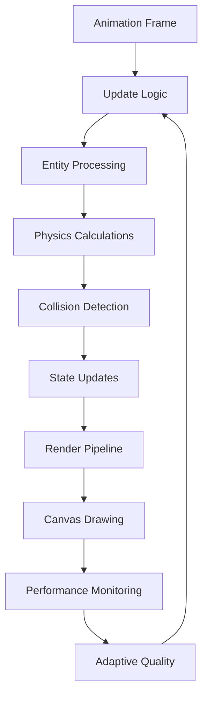
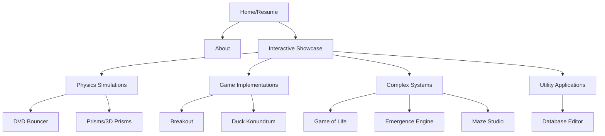
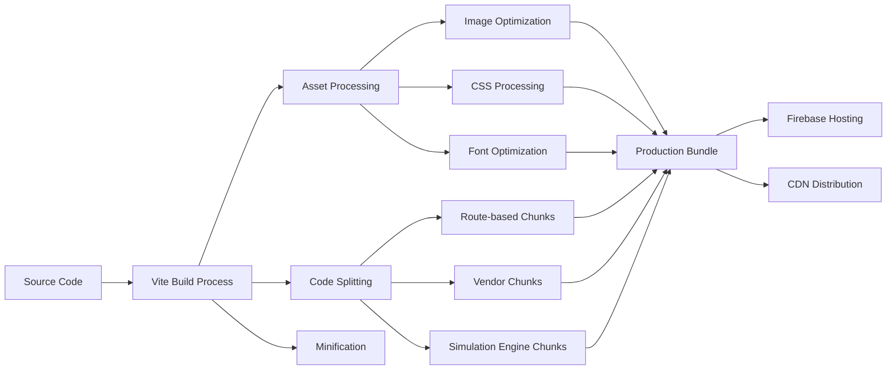

# Portfolio Architecture Documentation

## System Overview

This React-based developer portfolio showcases interactive simulations, complex technical demonstrations, and modern web development practices. The architecture demonstrates proficiency in React development, interactive web applications, game development, complex systems simulation, and modern web technologies built with Vite for fast development and optimized performance.

## Table of Contents

1. [System Context](#system-context)
2. [High-Level Architecture](#high-level-architecture)
3. [Component Architecture](#component-architecture)
4. [Data Flow Patterns](#data-flow-patterns)
5. [State Management Architecture](#state-management-architecture)
6. [Routing and Navigation Structure](#routing-and-navigation-structure)
7. [Build and Deployment Architecture](#build-and-deployment-architecture)
8. [Performance Architecture](#performance-architecture)
9. [Security Architecture](#security-architecture)
10. [Technology Stack](#technology-stack)

---

## System Context

### Primary Goal
Showcase technical expertise through interactive demonstrations while providing an engaging, accessible user experience that demonstrates modern React development practices.

### Key Stakeholders
- **Potential Employers**: Technical decision-makers evaluating React/JavaScript skills
- **Collaborators**: Developers interested in interactive simulation techniques  
- **Students/Learners**: Individuals studying complex systems, game development, or React patterns
- **End Users**: Anyone exploring interactive web applications and technical demonstrations

### External Systems Integration


### System Boundaries
- **Inside**: React application, simulation engines, design system, performance monitoring
- **Outside**: Hosting infrastructure, analytics services, browser APIs, user devices

---

## High-Level Architecture

### Architectural Style: Layered Component Architecture

The portfolio follows a layered architectural approach with clear separation of concerns:



### Core Architectural Principles

1. **Component-Based Modularity**: Each UI element is a self-contained, reusable component
2. **Engine-Driven Simulations**: Complex simulations are abstracted into dedicated engine classes
3. **Performance-First Design**: All interactive elements prioritize 60fps performance
4. **Accessibility Integration**: WCAG 2.1 AA compliance built into component design
5. **Progressive Enhancement**: Core functionality works without JavaScript, enhanced with interactive features

---

## Component Architecture

### Component Hierarchy Overview



### Component Categories

#### **Page Components** (`src/pages/`)
**Responsibility**: Top-level route components that orchestrate entire page experiences

- **Resume.jsx**: Professional experience showcase with print optimization
- **Bio.jsx**: Personal background and story presentation  
- **InteractiveShowcase.jsx**: Hub component displaying available simulations
- **Simulation Pages**: Individual interactive demonstrations

**Common Patterns**:
```javascript
// Standard page component structure
const PageComponent = () => {
  const [pageState, setPageState] = useState(initialState);
  const { theme } = useTheme();
  
  useEffect(() => {
    // Page-specific setup and cleanup
  }, []);
  
  return (
    <InteractivePageWrapper theme={theme}>
      <PageContent />
      <PageControls />
    </InteractivePageWrapper>
  );
};
```

#### **UI Components** (`src/components/`)
**Responsibility**: Reusable interface elements with consistent Material Design 3 styling

- **Navbar.jsx**: Site-wide navigation with responsive mobile menu
- **GameCanvas.jsx**: Reusable canvas wrapper for simulations
- **ThemeToggle.jsx**: Theme switching interface
- **ColorSchemeSelector.jsx**: Advanced color palette management

#### **Design System Components** (`src/design-system/`)
**Responsibility**: Production-ready component library with Material Design 3 compliance

- **Layout Components**: Page, Section, Stack, Grid system
- **Navigation Components**: Navbar, NavList, Breadcrumbs, Tabs
- **Core Components**: Button, Card, Typography, TextField, Checkbox
- **Theme Components**: ThemeProvider, ThemeVariantProvider, ThemeToggle

#### **Engine Classes** (`src/engine/`)
**Responsibility**: Complex simulation logic abstracted from UI concerns

- **CellularAutomata.js**: Conway's Game of Life and cellular automata rules
- **EmergenceEngineCore.js**: Multi-agent systems (flocking, neural networks, economics)
- **Metrics.js**: Real-time performance monitoring and optimization

---

## Data Flow Patterns

### Primary Data Flow: Unidirectional with React Hooks



### Theme System Data Flow



### Simulation Data Flow



---

## State Management Architecture

### Context-Based State Architecture

The portfolio uses React Context for global state management with specialized contexts for different concerns:

#### **ThemeContext** (`src/context/ThemeContext.jsx`)
**Scope**: Global theme and appearance state
**Responsibilities**:
- Theme mode management (light/dark/auto)
- Color palette selection and persistence
- System preference detection
- Accessibility announcements
- CSS custom property injection

```typescript
interface ThemeContextValue {
  mode: 'light' | 'dark' | 'auto';
  resolvedTheme: 'light' | 'dark';
  systemPrefersDark: boolean;
  lightPalette: string;
  darkPalette: string;
  currentPalette: string;
  setMode: (mode: string) => void;
  toggleTheme: () => void;
  // ... additional theme utilities
}
```

### Local State Patterns

#### **Simulation State Pattern**
Each simulation follows a consistent local state structure:

```javascript
const SimulationComponent = () => {
  // Core simulation state
  const [isRunning, setIsRunning] = useState(false);
  const [generation, setGeneration] = useState(0);
  const [entities, setEntities] = useState([]);
  
  // Configuration state  
  const [config, setConfig] = useState(defaultConfig);
  const [performance, setPerformance] = useState({ fps: 60, frameTime: 16 });
  
  // UI state
  const [showControls, setShowControls] = useState(true);
  const [debugMode, setDebugMode] = useState(false);
  
  // Custom hook for animation loop
  const { start, stop, reset } = useAnimationLoop(updateSimulation, isRunning);
  
  return (
    <SimulationContainer>
      <Canvas entities={entities} />
      <Controls config={config} onConfigChange={setConfig} />
    </SimulationContainer>
  );
};
```

### Custom Hooks for State Logic

#### **useGameOfLife Hook Pattern**
Complex state logic is extracted into custom hooks:

```javascript
const useGameOfLife = (initialGrid, rules) => {
  const [grid, setGrid] = useState(initialGrid);
  const [generation, setGeneration] = useState(0);
  const [isRunning, setIsRunning] = useState(false);
  const [statistics, setStatistics] = useState({ liveCells: 0, patterns: [] });
  
  const nextGeneration = useCallback(() => {
    setGrid(currentGrid => {
      const newGrid = calculateNextGeneration(currentGrid, rules);
      setGeneration(gen => gen + 1);
      setStatistics(calculateStatistics(newGrid));
      return newGrid;
    });
  }, [rules]);
  
  const animationRef = useRef();
  
  useEffect(() => {
    if (isRunning) {
      const animate = () => {
        nextGeneration();
        animationRef.current = requestAnimationFrame(animate);
      };
      animationRef.current = requestAnimationFrame(animate);
    } else {
      cancelAnimationFrame(animationRef.current);
    }
    
    return () => cancelAnimationFrame(animationRef.current);
  }, [isRunning, nextGeneration]);
  
  return {
    grid,
    generation,
    isRunning,
    statistics,
    actions: {
      toggleRunning: () => setIsRunning(!isRunning),
      reset: () => {
        setGrid(initialGrid);
        setGeneration(0);
        setIsRunning(false);
      },
      step: nextGeneration,
      setCell: (x, y, value) => setGrid(toggleCell(grid, x, y, value))
    }
  };
};
```

---

## Routing and Navigation Structure

### Route Architecture

```javascript
// Primary route structure
const routeStructure = {
  '/': 'Resume (Default)',
  '/resume': 'Professional Experience',
  '/about': 'Personal Biography',
  '/sim-interactive': 'Interactive Showcase Hub',
  '/sim-interactive/dvd': 'DVD Bouncer Physics',
  '/sim-interactive/breakout': 'Breakout Game',
  '/sim-interactive/emergence': 'Emergence Engine',
  '/sim-interactive/duck-konundrum': 'Duck Konundrum Puzzle',
  '/sim-interactive/prisms': 'Prism Light Simulation',
  '/sim-interactive/prisms3d': '3D Prism Simulation',
  '/sim-interactive/gameoflife': 'Conway\'s Game of Life',
  '/sim-interactive/maze': 'Maze Generation Studio',
  '/sim-interactive/database-editor': 'Database Management Tool'
};
```

### Navigation Patterns

#### **Hierarchical Navigation Structure**


#### **Navigation State Management**
```javascript
// Navbar component with active state detection
const Navbar = () => {
  const location = useLocation();
  const { theme, toggleTheme } = useTheme();
  
  const navigationItems = [
    { path: '/resume', label: 'Resume', exact: true },
    { path: '/about', label: 'About' },
    { 
      path: '/sim-interactive', 
      label: 'Interactive',
      hasDropdown: true,
      subItems: simulationRoutes 
    }
  ];
  
  return (
    <nav className="navbar-fixed">
      {navigationItems.map(item => (
        <NavLink 
          key={item.path}
          to={item.path}
          className={({ isActive }) => 
            `nav-link ${isActive ? 'active' : ''}`
          }
        >
          {item.label}
        </NavLink>
      ))}
      <ThemeToggle onClick={toggleTheme} currentTheme={theme} />
    </nav>
  );
};
```

---

## Build and Deployment Architecture

### Build Pipeline Architecture



### Vite Configuration Architecture

```javascript
// vite.config.js - Current basic configuration
export default defineConfig({
  plugins: [react()],
  server: {
    host: '127.0.0.1',
    port: 5173
  }
  // Opportunities for enhancement:
  // - Bundle analysis
  // - Performance optimization
  // - PWA integration
  // - Advanced code splitting
});
```

### Deployment Strategy

#### **Current**: Firebase Hosting
- **Strengths**: Easy setup, integrated with Google services, good performance
- **Configuration**: Basic firebase.json setup
- **Process**: Manual deployment via Firebase CLI

#### **Recommended Enhancement**: Automated CI/CD
```yaml
# .github/workflows/deploy.yml (future enhancement)
name: Deploy to Firebase Hosting
on:
  push:
    branches: [main]
jobs:
  build-and-deploy:
    runs-on: ubuntu-latest
    steps:
      - uses: actions/checkout@v2
      - name: Setup Node.js
        uses: actions/setup-node@v2
        with:
          node-version: '18'
      - name: Install dependencies
        run: npm ci
      - name: Run tests
        run: npm test
      - name: Build
        run: npm run build
      - name: Deploy to Firebase
        uses: FirebaseExtended/action-hosting-deploy@v0
        with:
          repoToken: '${{ secrets.GITHUB_TOKEN }}'
          firebaseServiceAccount: '${{ secrets.FIREBASE_SERVICE_ACCOUNT }}'
          channelId: live
          projectId: your-project-id
```

---

## Performance Architecture

### Performance Monitoring Strategy

The portfolio implements comprehensive performance monitoring across multiple layers:

#### **Animation Performance**
```javascript
// Built into simulation engines
class PerformanceMonitor {
  constructor() {
    this.frameTimeHistory = [];
    this.currentFPS = 60;
    this.performanceMode = 'auto';
  }
  
  recordFrame(frameTime) {
    this.frameTimeHistory.push(frameTime);
    if (this.frameTimeHistory.length > 60) {
      this.frameTimeHistory.shift();
    }
    
    this.currentFPS = Math.round(1000 / this.averageFrameTime);
    
    // Adaptive quality adjustment
    if (this.currentFPS < 30) {
      this.suggestQualityReduction();
    }
  }
}
```

#### **Canvas Optimization Architecture**
```javascript
// Canvas performance optimization patterns
const OptimizedCanvas = ({ entities, debugMode }) => {
  const canvasRef = useRef();
  const offscreenCanvasRef = useRef();
  
  useEffect(() => {
    const canvas = canvasRef.current;
    const ctx = canvas.getContext('2d');
    
    // Device pixel ratio optimization
    const dpr = window.devicePixelRatio || 1;
    canvas.width = canvas.offsetWidth * dpr;
    canvas.height = canvas.offsetHeight * dpr;
    ctx.scale(dpr, dpr);
    
    // Performance optimizations
    ctx.imageSmoothingEnabled = true;
    ctx.imageSmoothingQuality = 'high';
  }, []);
  
  // Render optimization with dirty rectangle tracking
  const render = useCallback((entities) => {
    const ctx = canvasRef.current.getContext('2d');
    
    // Only clear and redraw changed regions
    const dirtyRegions = calculateDirtyRegions(entities, previousEntities.current);
    dirtyRegions.forEach(region => {
      ctx.clearRect(region.x, region.y, region.width, region.height);
      drawEntitiesInRegion(ctx, entities, region);
    });
    
    previousEntities.current = entities;
  }, []);
};
```

### Memory Management Architecture

#### **Entity Object Pooling**
```javascript
// Object pooling for high-frequency entity creation
class EntityPool {
  constructor(maxSize = 1000) {
    this.pool = [];
    this.maxSize = maxSize;
  }
  
  getEntity() {
    if (this.pool.length > 0) {
      return this.pool.pop().reset();
    }
    return new Entity();
  }
  
  releaseEntity(entity) {
    if (this.pool.length < this.maxSize) {
      this.pool.push(entity);
    }
  }
}
```

#### **Cleanup Patterns**
```javascript
// Standard cleanup pattern for simulations
const useSimulationCleanup = () => {
  const cleanupRefs = useRef([]);
  
  const addCleanupTask = (cleanupFn) => {
    cleanupRefs.current.push(cleanupFn);
  };
  
  useEffect(() => {
    return () => {
      cleanupRefs.current.forEach(cleanup => cleanup());
      cleanupRefs.current = [];
    };
  }, []);
  
  return { addCleanupTask };
};
```

---

## Security Architecture

### Client-Side Security Considerations

#### **Content Security Policy**
```html
<!-- Recommended CSP headers for enhanced security -->
<meta http-equiv="Content-Security-Policy" 
      content="default-src 'self'; 
               script-src 'self' 'unsafe-inline' https://www.googletagmanager.com; 
               style-src 'self' 'unsafe-inline' https://fonts.googleapis.com; 
               font-src 'self' https://fonts.gstatic.com;
               img-src 'self' data: https:;
               connect-src 'self' https://www.google-analytics.com;">
```

#### **Input Sanitization**
```javascript
// Input sanitization for simulation parameters
const sanitizeSimulationInput = (input) => {
  return {
    speed: Math.max(1, Math.min(100, parseInt(input.speed) || 60)),
    entityCount: Math.max(10, Math.min(1000, parseInt(input.entityCount) || 100)),
    rules: validateRules(input.rules)
  };
};
```

#### **Safe Local Storage Usage**
```javascript
// Safe localStorage operations with error handling
const safeLocalStorage = {
  getItem: (key, defaultValue = null) => {
    try {
      const item = localStorage.getItem(key);
      return item ? JSON.parse(item) : defaultValue;
    } catch {
      return defaultValue;
    }
  },
  
  setItem: (key, value) => {
    try {
      localStorage.setItem(key, JSON.stringify(value));
      return true;
    } catch {
      return false;
    }
  }
};
```

---

## Technology Stack

### Current Technology Architecture

#### **Core Framework**
- **React 18.2.0**: Modern functional components with hooks, concurrent features
- **React Router DOM 6.3.0**: Client-side routing with nested route support
- **Vite 3.1.0**: Fast build tool with hot module replacement

#### **Styling and Design**
- **Bootstrap 5.3.7**: Responsive grid system and utility classes
- **Material Design 3**: Custom implementation with design tokens
- **CSS Custom Properties**: Theme system and responsive design
- **Lucide React 0.511.0**: Modern icon library

#### **Interactive Technologies**
- **HTML5 Canvas**: 2D graphics rendering for simulations
- **RequestAnimationFrame**: Smooth 60fps animations
- **Web APIs**: LocalStorage, MatchMedia, Performance API

#### **Build and Deployment**
- **Vite**: Development server and production build optimization
- **Firebase Hosting**: Static site hosting with global CDN
- **ESLint/Prettier**: Code quality and formatting (implicit)

### Architecture Evolution Recommendations

#### **Near-term Enhancements**
```json
{
  "dependencies": {
    "zustand": "^4.5.0",        // Modern state management
    "framer-motion": "^11.0.0", // Advanced animations
    "@tanstack/react-query": "^5.0.0", // Server state management
    "react-error-boundary": "^4.0.0"   // Error handling
  },
  "devDependencies": {
    "vitest": "^1.3.0",                    // Modern testing
    "@testing-library/react": "^14.2.0",   // Component testing
    "storybook": "^7.6.0",                 // Component documentation
    "@storybook/addon-docs": "^7.6.0"      // Interactive documentation
  }
}
```

#### **Long-term Architecture Evolution**
- **Next.js Migration**: Server-side rendering and performance optimization
- **TypeScript Integration**: Gradual migration for enhanced type safety
- **Web Workers**: Heavy computation offloading
- **WebGL/Three.js**: Advanced 3D graphics for complex simulations
- **PWA Features**: Offline capability and installation

---

## Architecture Decision Records (ADRs)

### ADR-001: React Hooks Over Class Components
**Status**: Accepted  
**Context**: Modern React development and performance optimization  
**Decision**: Use functional components with hooks exclusively  
**Consequences**: Better performance, simpler testing, future-proof architecture

### ADR-002: Vite Over Create React App  
**Status**: Accepted  
**Context**: Build performance and development experience  
**Decision**: Use Vite for faster builds and better developer experience  
**Consequences**: Improved development speed, modern build optimizations

### ADR-003: Canvas Over WebGL for Current Simulations
**Status**: Accepted  
**Context**: Complexity vs. performance trade-offs  
**Decision**: Use HTML5 Canvas for 2D simulations, reserve WebGL for future 3D content  
**Consequences**: Easier maintenance, sufficient performance for current needs

### ADR-004: Context API Over Redux for State Management
**Status**: Accepted  
**Context**: Application complexity and state management needs  
**Decision**: Use React Context for global state, local state for components  
**Consequences**: Simpler architecture, reduced bundle size, sufficient for current scope

---

## Conclusion

This architecture successfully balances technical sophistication with maintainable, accessible code. The layered component architecture provides clear separation of concerns while the engine-driven simulation approach allows for complex interactive demonstrations without compromising the React component model.

Key architectural strengths:
- **Scalable Component Architecture**: Easy to add new simulations and components
- **Performance-Conscious Design**: Built-in monitoring and optimization
- **Accessibility Integration**: WCAG compliance built into the foundation
- **Modern Development Practices**: Current React patterns and build tools

The architecture positions the portfolio as both a demonstration of technical capability and a foundation for future enhancement and learning.